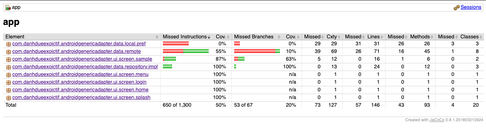
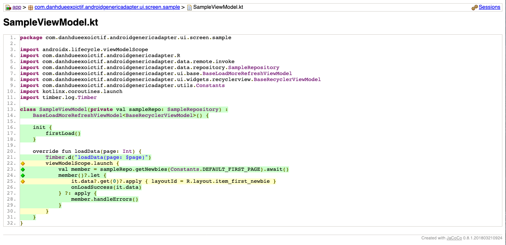
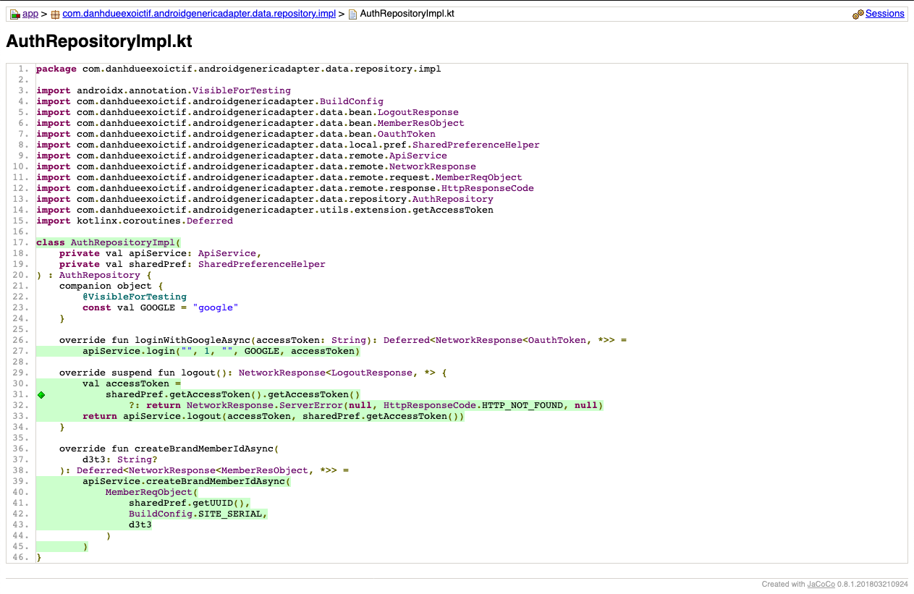

Android Generic Adapter - A sample base code.
=============================================

A project based on [Android Jetpack][0], [Kotlin][29], [MVVM architecture][28] & [Dependency Injection][27] using [Koin][24].

Introduction
------------

This project is a sample base code that implements the MVVM architecture and uses Android Jetpack.

Technical Information used in this project:

1. Programming Language: [Android Kotlin][29].
2. Architecture: [MVVM architecture][28] based on [Android Jetpack][0].  For more resources on learning Android development, visit the [Developer Guides](https://developer.android.com/guide/) at [developer.android.com](https://developer.android.com).
3. Android Components: ([Navigation][8], [ViewModel][9], [LiveData][7], [Data Binding][5], [Lifecycles][6], [Android Material Design][31], [etc][16]...).
4. Multiple Threads: [Kotlin Coroutine][26].
5. Third Party Libraries: [Glide][14], [Retrofit][30], [Koin][24], [Firebase][25], [MockK][22], [etc][16],...
6. Unit Test: [Android testing framework][3], [MockK][22], and [Robolectric][32]; Unit Test coverage Analysis using [JaCoCo][23].
7. [ScreenShots][17]

Moreover, you can read more detail about some project components by clicking to links contained at [References][18] part.

Libraries Used
--------------

* [Foundation][0] - Components for core system capabilities, Kotlin extensions and support for
  multidex and automated testing.
  * [AppCompat][1] - Degrade gracefully on older versions of Android.
  * [Android KTX][2] - Write more concise, idiomatic Kotlin code.
  * [Test][3] - An Android testing framework for unit and runtime UI tests.
* [Architecture][4] - A collection of libraries that help you design robust, testable, and
  maintainable apps. Start with classes for managing your UI component lifecycle and handling data
  persistence.
  * [Data Binding][5] - Declaratively bind observable data to UI elements.
  * [Lifecycles][6] - Create a UI that automatically responds to lifecycle events.
  * [LiveData][7] - Build data objects that notify views when the underlying database changes.
  * [Navigation][8] - Handle everything needed for in-app navigation.
  * [ViewModel][9] - Store UI-related data that isn't destroyed on app rotations. Easily schedule
     asynchronous tasks for optimal execution.
* [UI][10] - Details on why and how to use UI Components in your apps - together or separate
  * [Animations & Transitions][11] - Move widgets and transition between screens.
  * [Fragment][12] - A basic unit of composable UI.
  * [Layout][13] - Lay out widgets using different algorithms.
* Third party
  * [Glide][14] for image loading
  * [Kotlin Coroutines][15] for managing background threads with simplified code and reducing needs for callbacks
  * [MockK][22] for unit test mocking. That provides DSL to mock behavior. Built from zero to fit Kotlin language.
    Supports named parameters, object mocks, coroutines and extension function mocking.
  * [JaCoCo][23] for Unit Test Coverage Analysis.
  * [Koin][24] for Dependency Injection.
  * [Firebase][25] for Crashlytics, Analytics, Push Notification,....
  * [Retrofit][30] for Networking.
  * And a few other libraries ....

[0]: https://developer.android.com/jetpack/components
[1]: https://developer.android.com/topic/libraries/support-library/packages#v7-appcompat
[2]: https://developer.android.com/kotlin/ktx
[3]: https://developer.android.com/training/testing/
[4]: https://developer.android.com/jetpack/arch/
[5]: https://developer.android.com/topic/libraries/data-binding/
[6]: https://developer.android.com/topic/libraries/architecture/lifecycle
[7]: https://developer.android.com/topic/libraries/architecture/livedata
[8]: https://developer.android.com/topic/libraries/architecture/navigation/
[9]: https://developer.android.com/topic/libraries/architecture/viewmodel
[10]: https://developer.android.com/guide/topics/ui
[11]: https://developer.android.com/training/animation/
[12]: https://developer.android.com/guide/components/fragments
[13]: https://developer.android.com/guide/topics/ui/declaring-layout
[14]: https://bumptech.github.io/glide/
[15]: https://kotlinlang.org/docs/reference/coroutines-overview.html
[16]: https://github.com/DanhDue/AndroidGenericAdapter#libraries-used
[17]: https://github.com/DanhDue/AndroidGenericAdapter#screenshots
[18]: https://github.com/DanhDue/AndroidGenericAdapter#references
[19]: https://viblo.asia/p/change-android-application-brightness-like-a-boss-djeZ1ok85Wz
[20]: https://viblo.asia/p/how-to-play-youtube-videos-in-an-android-webview-with-just-a-few-lines-of-code-RQqKL9mbZ7z
[21]: https://viblo.asia/p/setup-jacoco-for-android-project-gGJ59zB9KX2
[22]: https://mockk.io/
[23]: https://www.jacoco.org/jacoco/trunk/index.html
[24]: https://insert-koin.io/
[25]: https://firebase.google.com/
[26]: https://kotlinlang.org/docs/reference/coroutines-overview.html
[27]: https://en.wikipedia.org/wiki/Dependency_injection
[28]: https://en.wikipedia.org/wiki/Model%E2%80%93view%E2%80%93viewmodel
[29]: https://kotlinlang.org/
[30]: https://square.github.io/retrofit/
[31]: https://material.io/develop/android/
[32]: http://robolectric.org/
[33]: https://viblo.asia/p/calbacks-trong-ung-dung-android-RnB5pk87lPG
[34]: https://viblo.asia/p/change-retrofits-base-url-at-runtime-ORNZqDLMK0n

Screenshots
-----------
1. Coverage Overview.

2. Unit Test Detail for a ViewModel.

3. Unit Test Detail for a Repository

References
----------
* [Change Android Retrofit's Base Url at runtime.][34]
* [Change Android Brightness.][19]
* [Play Youtube videos on Androids.][20]
* [ Setup Jacoco for Android Project.][21]
* [Callbacks in Android Application.][33]

License
-------

Copyright 2020 DanhDue ExOICTIF, danhdue@gmail.com

Licensed to the Apache Software Foundation (ASF) under one or more contributor
license agreements.  See the NOTICE file distributed with this work for
additional information regarding copyright ownership.  The ASF licenses this
file to you under the Apache License, Version 2.0 (the "License"); you may not
use this file except in compliance with the License.  You may obtain a copy of
the License at

  http://www.apache.org/licenses/LICENSE-2.0

Unless required by applicable law or agreed to in writing, software
distributed under the License is distributed on an "AS IS" BASIS, WITHOUT
WARRANTIES OR CONDITIONS OF ANY KIND, either express or implied.  See the
License for the specific language governing permissions and limitations under
the License.
